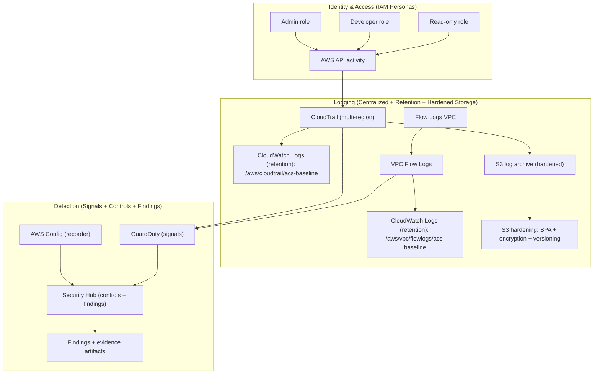

# AWS Cloud Security Baseline (IAM + Logging + Detection + Remediation)

[](https://github.com/MrRedhu/aws-cloud-security-baseline/actions/workflows/terraform.yml)


A secure-by-default AWS baseline that demonstrates **least-privilege IAM**, **centralized and hardened logging**, **threat detection (GuardDuty + Security Hub)**, and **evidence-backed remediations**.
This repo is designed to be **deployable, reproducible, and auditable** - similar to what cloud security teams ship as an internal baseline.

## Why this matters
- Most real-world cloud incidents start with over-permissioned IAM, missing audit logs, or weak detections.
- This baseline shows how to build those controls as code, then prove them with repeatable evidence.

## What this proves
- IAM design for **realistic personas** (Admin / Developer / Read-only) using least privilege
- Audit-grade **logging pipeline** (CloudTrail + VPC Flow Logs + CloudWatch + hardened S3)
- **Detection** enabled and validated using safe simulations
- **Remediation** workflows with before/after evidence
- Incident response thinking via a short **runbook**

## Architecture (high level)



## What Gets Deployed
- **IAM personas**: Admin / Developer / ReadOnly roles + least-privilege developer policy
  - Optional demo-only wildcard policy (not attached by default): `create_bad_policy_example=true`
- **Logging baseline**: CloudTrail (S3 + CloudWatch Logs), CloudWatch retention, hardened S3 log archive, VPC Flow Logs to CloudWatch
- **Detection baseline**: GuardDuty + Security Hub (AWS FSBP standard)
- **Config dependency**: AWS Config recorder + delivery channel + hardened S3 archive (required for Security Hub controls)

---

## Repo navigation
- Environment + guardrails: `evidence/00-environment.md`
- Architecture diagram source: `diagrams/architecture.mmd`
- Incident runbook: `runbooks/guardduty-triage.md`

## Evidence links
- IAM: `evidence/01-iam-before-after.md`
- Logging: `evidence/02-logging-before-after.md`
- Detection: `evidence/03-detection-findings.md`
- Remediation 1 (SG open SSH): `evidence/04-remediation-1-sg-open.md`
- Remediation 2 (S3 public access): `evidence/05-remediation-2-s3-public.md`
- Remediation 3 (IAM wildcard): `evidence/06-remediation-3-iam-wildcards.md`

## What I built
- Terraform modules and resource wiring for IAM personas, CloudTrail, VPC Flow Logs, CloudWatch retention, S3 hardening, GuardDuty, Security Hub, and AWS Config
- Reproducible evidence workflow for before-and-after control states instead of a one-time lab screenshot
- Safe remediation walkthroughs that show how findings appear, how to verify them, and how to return the environment to a good state
- A short GuardDuty triage runbook so the repo reads like an operational security baseline rather than only an infrastructure demo

## Lessons learned
- Security tooling becomes much more credible when the repo shows validation and remediation, not just service enablement
- AWS Config is easy to overlook, but it is a real dependency for useful Security Hub control coverage
- A strong cloud-security project needs both preventive controls and operator-friendly evidence collection
- Publishing cloud work safely means documenting guardrails, costs, and cleanup paths alongside the happy path

## Reproduce (deploy -> simulate -> remediate -> destroy)
### Prereqs
- Terraform `>= 1.5`
- AWS CLI authenticated to a sandbox account (region defaults to `us-east-1`)

Recommended (disable AWS CLI pager for copy/paste evidence):
```powershell
$env:AWS_PAGER=""
```

### Deploy
```powershell
cd terraform
terraform init
terraform apply
terraform output
```

### Simulate + Remediate (safe demos)
Each remediation doc has a **Reproduce (safe demo)** section with:
- simulate misconfiguration
- verify-before
- fix
- verify-after + cleanup

Helper scripts (print commands by default):
- `scripts/collect_evidence.ps1` / `scripts/collect_evidence.sh`
- `scripts/simulate_findings.ps1` / `scripts/simulate_findings.sh`

Start here:
- `evidence/04-remediation-1-sg-open.md` (Security Hub control `EC2.18`)
- `evidence/05-remediation-2-s3-public.md` (public S3 policy -> blocked)
- `evidence/06-remediation-3-iam-wildcards.md` (bad wildcard -> least privilege; requires `create_bad_policy_example=true` once)

Findings can take several minutes to appear/update in Security Hub; the demos include AWS-native before/after verification regardless.

### Destroy
```powershell
cd terraform
terraform destroy
```

Optional (sandbox convenience): allow Terraform to delete non-empty log/config buckets during destroy:
```powershell
cd terraform
terraform destroy -var="force_destroy_buckets=true"
```

If destroy fails because S3 buckets contain logs, empty the buckets from `terraform output` (`log_bucket_name`, `config_bucket_name`) and re-run destroy:
```powershell
aws s3 rm s3://<bucket> --recursive --no-cli-pager
terraform destroy
```

## Cost & Safety Notes
- Enable a budget and use a dedicated sandbox account if possible.
- Ongoing costs can include CloudTrail, CloudWatch Logs ingestion/retention, S3 storage, GuardDuty, Security Hub, and AWS Config.
- All simulations are reversible misconfigurations only (no exploitation). Do not commit secrets.
