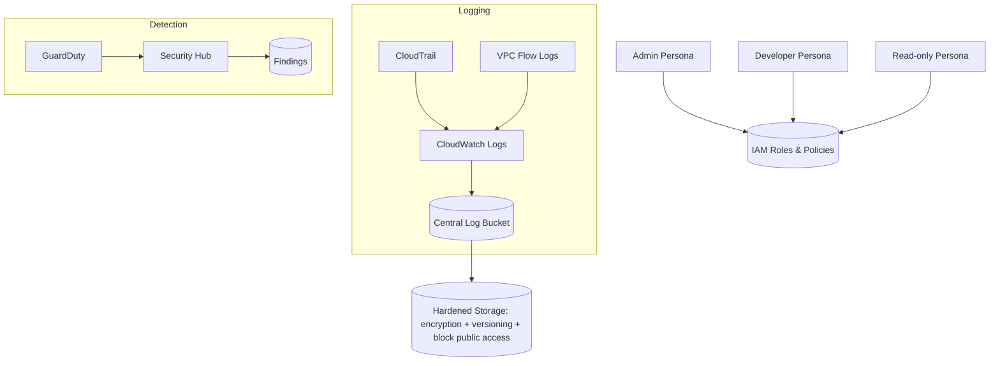

# AWS Cloud Security Baseline (IAM + Logging + Detection + Remediation)

A secure-by-default AWS baseline that demonstrates **least-privilege IAM**, **centralized and hardened logging**, **threat detection (GuardDuty + Security Hub)**, and **evidence-backed remediations**.  
This repo is designed to be **deployable, reproducible, and auditable** - similar to what cloud security teams ship as an internal baseline.

## What this proves
- IAM design for **realistic personas** (Admin / Developer / Read-only) using least privilege
- Audit-grade **logging pipeline** (CloudTrail + VPC Flow Logs + CloudWatch + hardened S3)
- **Detection** enabled and validated using safe simulations
- **Remediation** workflows with before/after evidence
- Incident response thinking via a short **runbook**

## Architecture (high level)

---

## Repo navigation
- Environment + guardrails: `evidence/00-environment.md`
- Architecture diagram source: `diagrams/architecture.mmd`
- Incident runbook (template): `runbooks/guardduty-triage.md`

## Evidence workflow (how this repo will be "proven")
As I build the baseline, I will capture before/after evidence in:
- IAM: `evidence/01-iam-before-after.md`
- Logging: `evidence/02-logging-before-after.md`
- Detection: `evidence/03-detection-findings.md`
- Remediations: `evidence/04-06-remediation-*.md`
